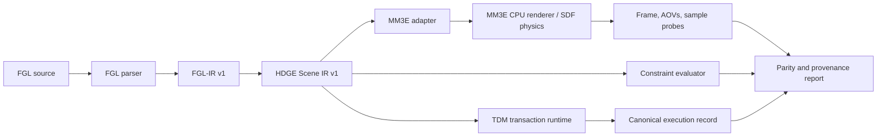

# Milestone 3 — Holographic Declarative Game Engine Integration Blueprint

## Decision summary

Milestone 3 should integrate HDGE as a **layered, deterministic scene-and-runtime system**, not as an immediate claim of a literal five-dimensional engine. The existing Schoff Constraint Laboratory already provides a validated foundation: FGL parsing, a versioned FGL-IR, explicit reference geometry, CPU signed-distance evaluation, and a three-phase TDM trace. The next step is to make that foundation into an HDGE runtime contract and then bridge it to the Atom 3D Engine (MM3E) through a version-pinned adapter.

The recommended strategy is **adapter first, embedding later**. HDGE should own its language semantics, canonical scene data, constraint records, TDM transaction trace, and tests. MM3E should initially be treated as a replaceable renderer/physics execution backend. This separation keeps the Schoff research contracts stable while MM3E continues to evolve its APIs. MM3E’s public integration guidance specifically advises users to pin a tested commit rather than depend on its moving `main` branch.[1]

> The first Milestone 3 deliverable should be a reproducible “HDGE Slice 0”: compile `☉⊗⚘∎` into an HDGE world, run one software TDM cycle, evaluate declared constraints, render or export a backend scene, and produce a provenance-rich execution record.

## Reconciled architecture

The HDGE design document proposes an SDF-native architecture, an eight-atom decomposition, an engine/policy split, SMT validation, and a three-phase Triton TDM heartbeat. The implementation to date has already established a compatible reference layer for FGL, PSSE, MOFP, software TDM, and a small union-SDF scene model. The public MM3E architecture independently exposes a closely aligned two-crate split: **`mm3e-kit`** owns mathematics, SDF primitives, camera, marching, shading, and framebuffer behavior; **`mm3e-orchestrator`** owns scenes, world-field closure, lighting, render policy, animation, and scene I/O.[2]

The integration should preserve three distinct responsibilities.

| Responsibility | Owner | Why it belongs there |
|---|---|---|
| FGL syntax, FGL-IR, PSSE provenance, MOFP links, symbol mapping, constraint declarations, TDM event history | **HDGE semantic layer** | These are Schoff Research Program contracts and must remain inspectable without a renderer dependency. |
| SDF primitive construction, CSG, ray marching, camera, shading, materials, collision queries, frame generation | **MM3E execution layer** | MM3E already specializes in analytic SDF scene execution and deliberately separates low-level mechanism from policy.[2] |
| Scene compilation policy, backend configuration, deterministic trace, validation, output comparison, rendering mode selection | **HDGE orchestration adapter** | This is the controlled boundary where HDGE commitments are translated into a tested MM3E revision. |

## Eight-atom operational mapping

The HDGE and MM3E both name `scan`, `hash`, `fold`, `project`, `scale`, `compare`, `combine`, and `order`. Milestone 3 should treat these as traceable implementation categories rather than as unexplained metaphysical operators.

| Atom | HDGE reference responsibility | First concrete implementation |
|---|---|---|
| Scan | Sampling declared world state | Camera/sample-grid request object plus SDF sample trace |
| Hash | Stable identity and provenance | Canonical IR digest, scene revision ID, MOFP/member references |
| Fold | Evaluate world closure | Deterministic union/min fold over primitive distances |
| Project | Transform declarations into a view or backend object | FGL-IR → HDGE Scene IR → backend scene adapter |
| Scale | Apply explicit modifiers and transforms | Modifier chain with an audit trail; no hidden unit conversion |
| Compare | Check distance, bounds, and declarative rules | Constraint results, SDF sample comparisons, later SMT boundary |
| Combine | Declare CSG/material/light composition | Initial union; then named union/intersection/subtraction operations |
| Order | Sequence changes without pretending they are timeless | TDM transaction records and canonical command ordering |

## Target component architecture

The **HDGE Scene IR v1** should be new and more general than the current FGL-IR. FGL-IR remains the source-provenanced language result. HDGE Scene IR expresses execution-ready primitives, transforms, materials, CSG operations, camera, declared constraints, and back-end-neutral metadata.

| Contract | Purpose | Initial fields |
|---|---|---|
| `schoff.fgl-ir/v1` | Preserve the source clause and reference mapping | Existing FGL symbols, meanings, roles, scene, constraints, provenance |
| `hdge.scene/v1` | Backend-neutral executable world | scene ID, world revision, primitives, transforms, CSG tree, material/light references, camera, constraints, provenance |
| `hdge.tdm-run/v1` | Auditable three-phase runtime record | base scene digest, phase, submitted command, validation result, candidate digest, commit/rollback decision |
| `hdge.backend-report/v1` | Backend reproducibility and parity evidence | MM3E repository URL, pinned revision, renderer mode, frame/sample hashes, AOV metadata, comparison tolerance |

## TDM runtime semantics

Milestone 3 should make the three TDM phases a transparent software transaction model. It should not make hardware, acoustic, biological, or consciousness claims.

| Phase | HDGE software behavior | Mutability rule |
|---|---|---|
| `ANCHOR` | Load the immutable committed scene revision; verify its digest, required constraints, and declared baseline. | Read-only. |
| `INSERT` | Parse a candidate command or scene patch and place it into a staging record. | Staging-only; no live world mutation. |
| `EXPAND` | Evaluate the candidate scene, run constraint checks, collect SDF samples/render evidence, and decide commit or rollback. | Candidate-only until all required checks pass. |

A committed state change must contain a complete `hdge.tdm-run/v1` record. The initial commit policy should be simple: required syntax, scene well-formedness, unique IDs, finite parameters, and declared bound checks must pass. Future SMT checks may become additional required gates, but they should not be simulated before their logic is formally defined.

## Staged build plan

### M3.0 — Contract and oracle layer

Create `hdge.scene/v1`, `hdge.tdm-run/v1`, and `hdge.backend-report/v1` schemas. Implement canonical JSON serialization and SHA-256 digests. Add an `HDGEWorld` object that converts the existing FGL-IR subset into HDGE Scene IR. The current Python SDF evaluator remains the semantic oracle.

**Exit gate:** a fixed FGL source produces byte-stable canonical Scene IR, a stable digest, a valid TDM trace, and all schema checks pass.

### M3.1 — Declarative operations and execution trace

Add explicit scene operations: `union`, `intersection`, `subtraction`, `smooth_union`, `translate`, `uniform_scale`, and material assignment. Every operation must declare inputs, outputs, parameters, provenance, and validation status. The runtime must reject undefined references, duplicate IDs, non-finite values, and unbounded or invalid primitive parameters.

**Exit gate:** tests demonstrate valid and invalid operation graphs, deterministic replay, rollback on failed constraints, and stable result digests.

### M3.2 — MM3E CPU adapter

Introduce a small Rust bridge, tentatively `hdge-mm3e-bridge`, as a separate workspace member or sibling project. It consumes `hdge.scene/v1`, maps its supported primitive/CSG subset to MM3E objects, and exports a deterministic CPU render plus sample-probe report. Pin an exact MM3E Git revision and record it in both `Cargo.lock` and `hdge.backend-report/v1`; do not track `main` directly.[1]

The first adapter should use the smallest common subset: sphere, box, plane, union, a static camera, and static material/light defaults. It should not yet add UI, live input, audio, mesh import, network synchronization, GPU controls, or custom physics.

**Exit gate:** CPU parity tests compare Python-oracle sample probes against MM3E at declared coordinates within an explicit tolerance. A fixed scene must generate a stable backend report and a reviewable frame artifact for the pinned backend version.

### M3.3 — Constraint and physics boundary

Add a constraint adapter interface with two backends: an initial transparent Python rule evaluator and an optional Z3 backend for precisely defined integer, bit-vector, or equality constraints. Keep SDF collision queries separate from logical constraints: the field provides distance and normal data, while the constraint engine evaluates declared invariants. This follows the HDGE specification’s intention to use SMT only before a mutation is accepted, not as a substitute for rendering.

**Exit gate:** satisfiable and unsatisfiable fixtures produce deterministic accept/reject decisions and store the model or failure explanation in the execution record.

### M3.4 — GPU parity and interactive shell

MM3E’s current roadmap reports an opt-in `mm3e-gpu` WGSL/wgpu backend, a real-time GPU viewer, and SDF-native physics examples, but it also cautions that the engine and surrounding APIs continue to evolve.[3] The HDGE integration should use GPU execution only after M3.2 CPU parity is stable. GPU output should be compared through scene/sample invariants and defined visual tolerances, not assumed identical at the pixel level across drivers.

**Exit gate:** the same `hdge.scene/v1` passes the CPU oracle and GPU adapter validation suite; renderer mode, device class, driver information where available, and tolerances are recorded in the backend report.

## Validation gates

| Gate | Evidence required | Blocks |
|---|---|---|
| V1: Canonical IR | Schema validation, byte-stable serialization, fixed digest fixtures | Any renderer adapter |
| V2: Operation safety | Valid/invalid graph tests, parameter guards, deterministic rollback | TDM commit capability |
| V3: Runtime trace | Complete anchor/insert/expand record for every attempted scene update | Persistent scene changes |
| V4: CPU parity | Declared probe points match oracle within tolerance; fixed frame artifact | GPU enablement |
| V5: Constraint evidence | Accept/reject fixtures and stored reasons/models | Automatic commit behavior |
| V6: GPU parity | Mode-specific tests and backend report | Interactive or performance claims |
| V7: Reproducibility | Pinned MM3E revision, lockfile, exact scene digest, command record | Any published benchmark or demo |

## First build sequence

The immediate build sequence for approval is intentionally narrow:

1. Add `hdge_scene.py` and schemas for `hdge.scene/v1`, `hdge.tdm-run/v1`, and `hdge.backend-report/v1`.
2. Implement canonical serialization and scene digests.
3. Compile the existing `☉⊗⚘∎` FGL fixture into HDGE Scene IR and create a complete three-phase execution record.
4. Add unit tests for deterministic replay, failed insertion rollback, duplicate-ID rejection, and scene-probe preservation.
5. Add an `hdge-run` command that emits the IR, runtime trace, and CPU reference probe report.
6. Only then create the MM3E bridge on a pinned external revision and implement the sphere/box/plane/union subset.

This order provides a genuine HDGE integration path while safeguarding the research program’s semantics from premature coupling to a renderer API.

## Explicit deferrals

The following items are intentionally deferred beyond the first Milestone 3 slice: literal 5D physical claims, custom acoustic output, chord-codon or medical applications, automatic AI-to-AI semantic inference, production security, mesh ingestion, ECS/editor systems, networked multiplayer, and bespoke GPU shader generation. Each may become a future research or engineering branch, but none is required to demonstrate that FGL declarations can become validated, reproducible SDF scenes.

## References

[1]: https://github.com/Lucerna-Labs/atom-rendering-engine/blob/main/ENGINE-INTEGRATION.md "Atom Rendering Engine Integration Guide"
[2]: https://github.com/Lucerna-Labs/atom-3d-engine/blob/main/ARCHITECTURE.md "MM3E architecture"
[3]: https://github.com/Lucerna-Labs/atom-3d-engine/blob/main/ROADMAP.md "MM3E Roadmap"
[4]: https://github.com/Mycelium-Node-1/UCST-AI/blob/main/Archive%20(2026)/HDGE%20Master%20Design%20Document%3A%20A%20Topological%20Architecture%20for%20Declarative%20Reality.docx "HDGE Master Design Document in UCST-AI"
[5]: https://github.com/Mycelium-Node-1/UCST-AI/blob/main/Archive%20(2026)/Triton%20TDM%20Technical%20Specification.docx "Triton TDM Technical Specification in UCST-AI"
