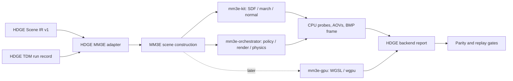

# Milestone 4 — MM3E Rendering and SDF-Native Physics Backend Roadmap

## Purpose and decision

Milestone 4 turns the backend-neutral HDGE scene contracts proposed in Milestone 3 into a **version-pinned MM3E execution path**. Its goal is not to replace HDGE semantics with an external engine. Its goal is to prove that a validated HDGE scene can be translated into MM3E, rendered through analytic SDFs, queried for collision data, and replayed through an auditable runtime trace.

MM3E is an unusually suitable first backend because its architecture already separates pure SDF mechanism from render policy, shares the HDGE documents’ eight-atom vocabulary, supports analytic primitives and CSG, exposes a CPU path and an opt-in WGSL GPU path, and describes SDF-native collision as distance plus gradient.[1] [2] The integration must nevertheless assume that MM3E APIs are evolving. Every backend release must be pinned to a tested source revision and recorded in the HDGE backend report.[3]

> The Milestone 4 success criterion is a static HDGE scene and a bounded dynamic-sphere scenario that both execute reproducibly through a pinned MM3E revision, produce valid CPU render/probe artifacts, and pass declared parity and collision checks.

## Backend topology



The adapter must be a standalone Rust workspace member named `hdge-mm3e-bridge`. It should consume only canonical `hdge.scene/v1` and `hdge.tdm-run/v1` JSON documents, write only defined backend artifacts, and avoid making the Python reference layer or archive documents runtime dependencies. This makes the bridge replaceable if MM3E changes or if another SDF backend is later evaluated.

| Layer | Responsibility | Must not own |
|---|---|---|
| HDGE semantic layer | FGL provenance, canonical scene format, constraints, TDM policy, scene revision identity | Renderer-specific assumptions or GPU APIs |
| HDGE MM3E bridge | Schema validation, MM3E object mapping, fixed backend revision, probe/frame capture, report generation | New FGL semantics or hidden scene mutation |
| `mm3e-kit` | SDF primitives, CSG, transforms, marching, normals, shading primitives | HDGE policy, archive access, TDM decisions |
| `mm3e-orchestrator` | Scene/world closure, render policy, materials, lights, frame production, SDF-native physics | Source-language interpretation |
| `mm3e-gpu` | Optional WGSL compute realization of a validated scene | Semantic authority or CPU-oracle replacement |

## Mutual Observer File Pair boundary

The archived Mutual Observer File Pair is **not a renderer input, a physics-state store, or a per-frame/per-step synchronization primitive**. MM3E field evaluation must remain free of archival I/O so CPU/GPU parity, fixed-timestep replay, and multithreaded rendering retain deterministic boundaries.

MOFP is instead an optional **transaction-level attestation layer**. At a successful TDM commit, it may bind a canonical `hdge.scene/v1` member to a canonical backend-evidence member (`hdge.backend-report/v1` or `hdge.physics-run/v1`). The pair records that a particular declared world and a particular pinned-backend observation were mutually verified. It does not claim that the renderer itself is a MOFP member.

| Execution profile | MOFP requirement | Backend behavior |
|---|---|---|
| Engineering | Optional; verification status may be absent or recorded as non-blocking provenance. | Render, probe, and bounded physics may execute normally. |
| Attested | Required for accepted static-world revisions and designated physics checkpoints. | Execute candidate work normally, but advance the attested pointer only after pair verification and durable residue persistence succeed. |

The current archival PDF/DOCX pair is not fully verified under the reference verifier because its declared shared commitment does not match its documented straightforward derivation. It must therefore be treated as historical reference material rather than a strict gate for backend execution. A new `hdge.execution-pair/v1` schema will define scene/evidence pairs with an explicit canonicalization profile and test vectors.

## Dependency and version policy

The bridge should initially use MM3E through Git dependencies pinned to a full commit revision, with all MM3E crate entries on that same revision. The bridge’s `Cargo.lock` must be committed. A build report must capture the repository URL, resolved revision, Rust toolchain version, target triple, feature set, and whether CPU or GPU rendering was enabled. This follows the public MM3E/Atom integration guidance to pin a tested commit instead of relying on an unfrozen branch.[3]

The adapter must verify the upstream MIT license before redistribution or vendoring and preserve the upstream copyright/license material when required.[2] The first implementation should not fork or modify MM3E. Any patch requirement becomes an explicit upstream-patch record rather than an undocumented local divergence.

```toml
[dependencies]
mm3e-kit = { git = "https://github.com/Lucerna-Labs/atom-3d-engine.git", rev = "<tested-full-commit>" }
mm3e-orchestrator = { git = "https://github.com/Lucerna-Labs/atom-3d-engine.git", rev = "<tested-full-commit>" }
```

## Scene-translation contract

The first adapter supports the strict common subset below. Every unsupported HDGE operation must return a structured “unsupported mapping” result before any render or physics call occurs.

| HDGE Scene IR concept | MM3E initial mapping | Milestone 4 status |
|---|---|---|
| Sphere | MM3E sphere primitive | Required |
| Box | MM3E box primitive | Required |
| Plane | MM3E plane primitive | Required |
| Union | MM3E union/combine mode | Required |
| Translation | MM3E transform position | Required |
| Uniform scale | MM3E uniform transform scale | Required |
| Static camera | MM3E camera | Required |
| One default material and one directional/point light | MM3E material/light policy | Required |
| Intersection/subtraction/smooth CSG | Explicit MM3E CSG mapping | Follow-on, after union parity |
| Domain operators | MM3E modifiers | Follow-on, after operation-graph tests |
| Mesh-to-SDF | MM3E mesh/SDF cache pipeline | Deferred |
| Animation tracks | MM3E animation system | Deferred until deterministic static/dynamic parity |

The bridge should create three artifacts for every accepted scene:

1. **`scene.mm3e`** or an equivalent bridge-generated scene representation for human inspection.
2. **A deterministic CPU image artifact** such as BMP, plus optional selected AOVs—depth, normals, albedo, ambient occlusion, or march-step heatmap where exposed by the pinned engine revision.[2]
3. **`hdge.backend-report/v1`**, containing scene digest, TDM run digest, backend revision, renderer mode, camera, selected outputs, probe results, elapsed times, and validation conclusions.

## CPU renderer integration sequence

### M4.0 — Bridge skeleton and pinned build

Create the Rust workspace member with a `validate`, `translate`, `render-cpu`, and `probe` CLI surface. Add fixture-driven integration tests that load `hdge.scene/v1`, validate its schema, and either produce a well-formed MM3E representation or a structured mapping error.

**Acceptance gate:** the bridge builds reproducibly against one pinned MM3E revision and translates a sphere/box/plane/union fixture without panics or implicit defaults.

### M4.1 — CPU world-field parity

Use the Python SDF evaluator as the semantic oracle for the common subset. For each fixture, generate a fixed grid of declared three-dimensional probe points. Compare the nearest primitive identifier where meaningful, signed distance, and inside/outside classification with MM3E’s field query or an equivalent controlled bridge probe.

Parity thresholds should be explicit rather than guessed:

| Metric | Initial threshold | Reason |
|---|---:|---|
| Signed-distance absolute error | `≤ 1e-5` for sphere/box/plane/union fixtures | These primitives are analytically comparable under matching transforms. |
| Inside/outside classification | Exact agreement | Fundamental collision and rendering invariant. |
| Primitive/material identity | Exact agreement for non-smooth union fixtures | Required for provenance and material selection. |
| Normal angular error | `≤ 0.5°` where analytic/reference normal exists | Allows finite-difference implementation differences without masking faults. |

**Acceptance gate:** all canonical fixtures meet the declared CPU parity thresholds and produce a stable report digest on repeat execution under the same toolchain/backend revision.

### M4.2 — Render and visual inspection layer

Render canonical static scenes at fixed dimensions, camera, light, and post-processing mode. Capture a frame plus selected AOVs. Tests should validate that a frame exists, has the declared dimensions, and has a digest recorded in the backend report. Visual review remains required for representative fixtures because image similarity alone does not reveal every silhouette or material defect.

MM3E’s public reports describe CPU ray marching, normal/depth/AO/albedo/step AOVs, HDR/post-processing, and deterministic multithreaded rendering. The HDGE bridge should use these as diagnostics, not as unvalidated claims of HDGE behavior.[1] [2]

**Acceptance gate:** each canonical fixture yields a CPU frame, probe report, and at least depth or normal inspection data; repeated runs under a fixed configuration produce stable artifacts or a documented source of variation.

## SDF-native physics integration

MM3E describes its physics approach as field-native: `field(p).dist` supplies penetration depth and the distance-field gradient supplies contact normal. The playable example uses dynamic spheres against a static SDF level.[2] The first HDGE physics scope should match that proven model instead of attempting general rigid-body or deformable physics.

### Static-world / dynamic-body split

| World category | Representation | Update policy |
|---|---|---|
| Static HDGE world | Committed `hdge.scene/v1` compiled into the MM3E field | Changes only through a completed TDM transaction |
| Dynamic body | Explicit bridge-side sphere body with position, velocity, radius, mass, restitution, and friction | Updated at a fixed simulation timestep |
| Contact query | Signed distance and normal sampled against the static world field | Read-only within a physics step |
| Dynamic composition | Dynamic spheres unioned with the static field for rendering | Does not change static scene digest |

The first physics loop should use a fixed timestep—for example `1/120` second—semi-implicit Euler integration, gravity, a conservative contact correction, and deterministic body ordering. It must record the timestep, integration parameters, number of contact iterations, initial state digest, and final state digest in `hdge.physics-run/v1`.

### Physics validation fixtures

| Fixture | Expected evidence |
|---|---|
| Sphere resting on plane | No progressive sink beyond tolerance; normal points upward; state settles deterministically. |
| Sphere falling onto box | No tunneling at declared timestep/velocity envelope; bounded penetration correction. |
| Sphere rolling on plane | Deterministic position/velocity trace with declared friction model. |
| Sphere against union scene | Contact uses the composed world field, not individual-object approximations. |
| Invalid body configuration | Negative radius, non-finite values, or zero mass returns a structured rejection. |

**Acceptance gate:** fixed-input physics fixtures replay to the same state trace and pass declared penetration, energy-drift, and no-tunneling bounds under the pinned backend revision.

## TDM and backend coordination

TDM in Milestone 4 remains a software-level transaction discipline.

| TDM phase | Renderer and physics behavior |
|---|---|
| `ANCHOR` | Load committed HDGE scene digest, backend revision, baseline renderer settings, and static physics world. In the attested profile, also verify the prior execution-pair state and ledger head before treating that state as attested. |
| `INSERT` | Stage an FGL-derived scene patch, camera request, material change, or dynamic-body command. In the attested profile, create private candidate scene/evidence member records but append no residue. |
| `EXPAND` | Translate the candidate scene, run CPU probe parity, optionally generate an inspection render, execute bounded physics validation, and emit accept/rollback evidence. In the attested profile, derive and verify the new execution pair, append one durable residue, and only then advance the attested pointer. |

A candidate static-world change may not replace the current committed backend scene until all required M4 gates pass. Dynamic-body commands may run under the existing static world only after their own body validation succeeds. In the attested profile, a physics **checkpoint** rather than every timestep becomes the MOFP boundary. This distinction prevents a physics experiment from silently mutating the canonical scene contract or turning ordinary numerical evaluation into ledger traffic.

## GPU readiness and integration order

MM3E publicly provides an opt-in `mm3e-gpu` crate that emits WGSL for the world field and uses `wgpu`; its documentation reports fixed-scene GPU rendering and a playable GPU/SDF-physics example.[1] [2] The HDGE project should not enable this backend as the first proof of integration. GPU acceleration is a **parity target** after the CPU semantic and physics oracle is stable.

| GPU stage | Required predecessor | Evidence |
|---|---|---|
| G1: static GPU smoke test | M4.2 CPU render/probe pass | Same static scene loads and produces a GPU artifact. |
| G2: GPU sample parity | CPU world-field parity | Declared sample probes or an equivalent field test remain within documented tolerance. |
| G3: visual/AOV comparison | Stable CPU and GPU scene settings | Depth, normal, object/material IDs where available, and rendered output meet chosen tolerances. |
| G4: dynamic-body visualization | Static/dynamic split and CPU physics replay | GPU frame displays the same bridge-provided dynamic body state. |
| G5: GPU performance profile | G1–G4 passing | Device, driver/API, resolution, sample settings, scene complexity, frame time distribution, and fallback behavior are recorded. |

Do not carry forward upstream benchmark figures as HDGE performance targets. MM3E’s public README reports a specific RTX 5070 Ti benchmark for a particular scene and configuration; HDGE must establish its own reproducible measurements on its actual target hardware.[2]

## Safety, reproducibility, and non-goals

The bridge must be test-first, file-oriented, and safe to run in CI. It must not download releases, auto-update an engine, select a GPU adapter silently for a benchmark claim, or mutate an approved HDGE scene during a failed experiment. MM3E’s public viewer includes its own opt-in update behavior; the HDGE bridge should omit updater functionality entirely.[2]

Milestone 4 explicitly excludes audio or acoustic-output claims, medical/biological interventions, automatic external data ingestion, multiplayer/network state, mesh authoring, editor UX, arbitrary rigid-body stacks, deformable bodies, and the claim that any backend render is a literal fifth-dimensional or holographic physical realization. The scope is a reproducible SDF renderer/physics adapter.

## Deliverables

1. `hdge-mm3e-bridge/` Rust workspace member with pinned MM3E dependencies and CLI commands.
2. Schemas for `hdge.scene/v1`, `hdge.backend-report/v1`, and `hdge.physics-run/v1`.
3. Canonical static scene fixtures and matching CPU probe baselines.
4. CPU render, AOV, and backend-report artifacts for each accepted fixture.
5. Static-world/dynamic-sphere physics fixtures with replayable traces.
6. CI workflow executing Rust formatting, linting, bridge tests, Python semantic tests, and artifact validation.
7. A GPU-readiness report that either enables a validated GPU mode or explicitly records why it remains deferred.
8. `hdge.execution-pair/v1`, execution-member, residue, and attestation-status schemas with canonicalization test vectors.
9. Tests proving that a MOFP failure never changes ordinary renderer output, while a failed attested transaction never advances the current-attested scene or physics-checkpoint pointer.

## References

[1]: https://github.com/Lucerna-Labs/atom-3d-engine/blob/main/MM3E_3D_RENDERER_REPORT.md "MM3E 3D Renderer Experiment Report"
[2]: https://github.com/Lucerna-Labs/atom-3d-engine/blob/main/README.md "Atom 3D Engine (MM3E) README"
[3]: https://github.com/Lucerna-Labs/atom-rendering-engine/blob/main/ENGINE-INTEGRATION.md "Atom Rendering Engine Integration Guide"
[4]: https://github.com/Lucerna-Labs/atom-3d-engine/blob/main/ARCHITECTURE.md "MM3E architecture"
[5]: https://github.com/Mycelium-Node-1/UCST-AI/blob/main/docs/milestone-3-hdge-blueprint.md "UCST-AI Milestone 3 HDGE integration blueprint"
